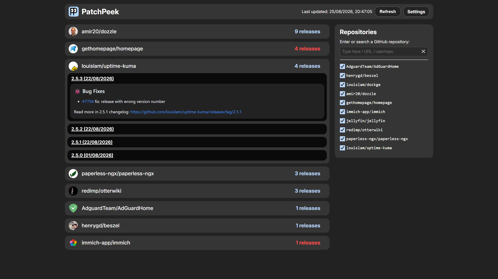

# PatchPeek

PatchPeek fetches the changelogs of releases on GitHub, while checking for any potential breaking changes and displays it all on a clean interface.

---



## Features

- Minimalistic interface
- Minimal usage of GitHub API tokens
  - Releases are pulled once an hour, so a token is not needed, but is recommended
- Changelogs with breaking changes are highlighted with red
- Add repos by GitHub URL or only the author/repo slug
- Search GitHub repositories live while entering a repository name
- Change the amount of days to look back for releases

## Important info

- The app uses it's own markdown renderer. This means not every feature from using GitHub's own renderer is available (like redirects for everything). This decision was made in order to not deal with images expiring without convoluted workarounds.

- The app's default pull window is 31 days (my personal interval of updating containers). While it does function if you enter for example 365 days, be aware of heavy GitHub API usage and longer load times. I am not condoning usage this far back, as I have not tested the rigidity of it.

## Docker Compose

- Create a directory and add a `docker-compose.yaml` file with the following contents:

```yaml
services:
  patchpeek:
    image: ghcr.io/ldannijs/patchpeek:latest
    container_name: patchpeek
    ports:
      - "3000:3000"
    volumes:
      - ./data:/app/data
    restart: unless-stopped
    # Uncomment the next line to run container as non-root user (node)
    # user: "1000:1000"
```

> [!NOTE]
> To run the container as rootless, uncomment the line as seen in the compose file, and then make sure you run:
>
> ```bash
> sudo chown -R 1000:1000 ./data
> ```

- Then start the container with:

```
docker compose up -d
```

Github token creation can be found here: https://github.com/settings/personal-access-tokens

## Locally running / Development

> [!NOTE]
> This project requires at least `Node 18`

- Clone the repo
- In the terminal, run:

```bash
npm install
npm run dev
```

## Motivation

This project came to fruition from me wanting to quickly know if any updates I were to do to my docker containers would break anything. I have used RSS feeds, discord notifications, etc. but they all felt too cumbersome to quickly give me the information i need at a glance.

Besides that I wanted to push myself to make a project like this and see how far i could get, alongside learn some stuff from it. Besides that, this is a small side hobby, so I don't have a ton of time to work on it and fix stuff. I hope you can understand! :)
